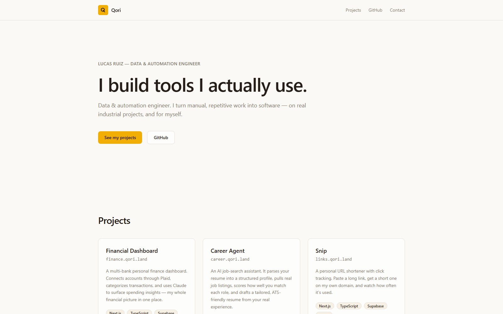

<div align="center">


# Qori

**I build tools I actually use.**

[](https://nextjs.org)
[](https://www.typescriptlang.org)
[](https://tailwindcss.com)
[](https://vercel.com)

### [▶ Visit qori.land →](https://qori.land)

</div>

<p align="center">
  
</p>

---

The umbrella home for **[qori.land](https://qori.land)** — a single-page index of the tools Lucas Ruiz
builds and uses. *Qori* is Quechua for **gold**, which is where the amber accent comes from. The hub
links out to three independently deployed projects, all sharing one design system.

## What it does

A static, single-page portfolio: a hero, three project cards, and a footer. No auth, no database, no
API routes — just a clean, fast front door that points to each project.

| Project | What it is | Live |
|---|---|---|
| **Financial Dashboard** | Multi-bank personal finance with AI insights | [finance.qori.land](https://finance.qori.land) |
| **Career Agent** | AI job-search assistant: parse, match, tailor | [career.qori.land](https://career.qori.land) |
| **Snip** | Personal URL shortener with click tracking | [links.qori.land](https://links.qori.land) |

## Tech stack

| Layer | Choice |
|---|---|
| Framework | Next.js 14 (App Router) + TypeScript |
| UI | Tailwind CSS (Qori "Sovereign" tokens), Geist via `next/font/local` |
| Hosting | Vercel |

## Run it locally

```bash
npm install
npm run dev      # http://localhost:3000
npm run build    # production build
```

## Roadmap

- New project cards as more tools ship
- A lightweight "now / building" note

---

Part of **[Qori](https://qori.land)** · built by **Lucas Ruiz**
