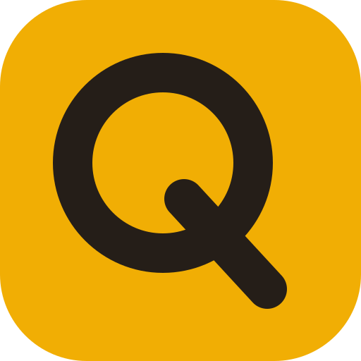
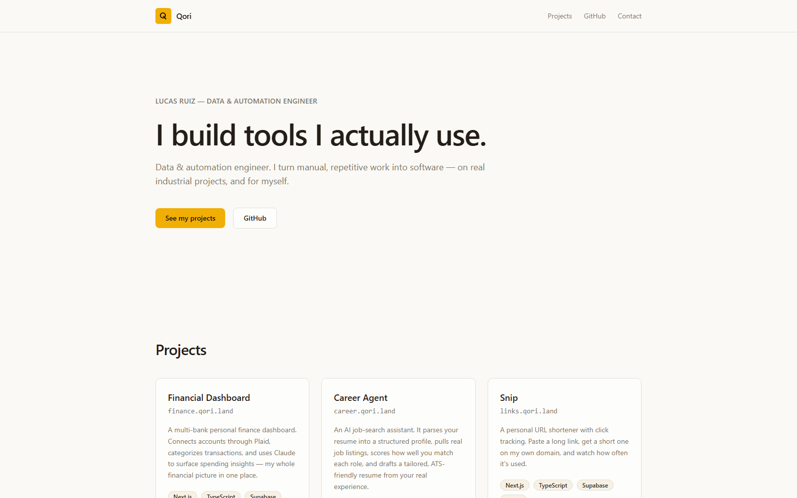

<div align="center">



# Qori

**I build tools I actually use.**

[](https://nextjs.org)
[](https://www.typescriptlang.org)
[](https://tailwindcss.com)
[](https://vercel.com)

### [Visit qori.land](https://qori.land)

</div>

<p align="center">
  
</p>

---

The home of **[qori.land](https://qori.land)**, Lucas Ruiz's portfolio: who he is, where he has
worked, the paper he co-authored, and the software he has shipped. *Qori* is Quechua for **gold**,
which is where the amber accent comes from. The site is static: no auth, no database, no API
routes.

## What is on it

Nine routes, all rendered from one content file, `lib/profile.ts`. Components only render; none
of them holds copy of its own.

| Route | What it is |
|---|---|
| `/` | The front page: hero, about, experience, research, skills, featured projects, interests |
| `/card` | A contact card with a save-to-contacts button |
| `/projects` | Every project, ranked: the featured set first, then the rest of the shelf |
| `/commissioning-automation` | The parent case study for the industrial commissioning work, with the named pieces under it |
| `/noe` | NoE Toolkit, a Windows desktop toolkit for energization documents and drawing markup |
| `/pims-rfcc` | PIMS & RFCC Automation, readiness reports and the sign-off flow |
| `/otto` | Otto, the personal AI assistant showcase |
| `/quorum` | Quorum, the agent-company OS, frozen |
| `/research/ppe-yolo` | The CVC 2026 paper on YOLO-based PPE monitoring |

Plus `sitemap.xml`, `robots.txt`, and generated Open Graph and Twitter images. The sitemap is
hand-listed in `app/sitemap.ts` on purpose, so a draft route never ships in it by accident.

The project cards on `/` and `/projects` are `FEATURED_PROJECTS` and `MORE_PROJECTS` in
`lib/profile.ts`. Live products link out to their own subdomains (`finance.qori.land`,
`career.qori.land`, `links.qori.land`, `rapidpdf.qori.land`); the case studies link to the routes
above.

## Editing content

Everything a visitor reads lives in `lib/profile.ts`. The rules that file enforces, worth reading
before editing it:

- Client, employer, project and person names stay anonymised. The employer is "Commissioning
  contractor" and the projects are described by industry, never by name.
- The project scale anchors are written once, in `SCALE`, and reused everywhere. Never restate
  them in a different form on another page.
- A project card has to link somewhere: a live URL, a public repo, or a case-study page. A card
  that links nowhere comes off the shelf.
- `IN_BUILD` is empty by design and renders nothing while it is empty. An entry needs a real state
  or date, never "coming soon".
- Card artwork is coded SVG in `components/CardArt.tsx`, one `ArtKey` per card. No screenshots.
- The Otto page publishes capability only: never how it is reached, where it runs, or any
  deployment detail.

## Tech stack

| Layer | Choice |
|---|---|
| Framework | Next.js 14 (App Router) + TypeScript |
| UI | Tailwind CSS (Qori "Sovereign" tokens), Geist via `next/font/local`, lucide icons, motion |
| Hosting | Vercel, see [DEPLOY.md](DEPLOY.md) |

## Run it locally

```bash
npm install
npm run dev      # http://localhost:3000
npm run lint
npm run build    # the same build Vercel runs
```

## Deploying

Pushes to `main` go live on qori.land through the Vercel Git integration. Details, the DNS layout
of the subdomains, and the one open item (Search Console verification) are in
[DEPLOY.md](DEPLOY.md).
